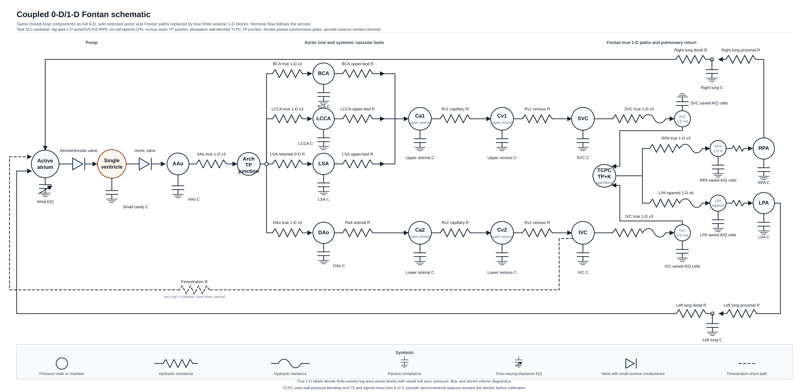

# Coupled 0-D/1-D Fontan Model Technical Reference

This document is generated from repository sources by `scripts/docs/build_model_reference_pdfs.py`. Edit the model config, implementation notes, schematic, or this generator, then regenerate the markdown and PDF together.

## Model Construction

### Scope and Status

Executable Task 012 prototype with true 1-D aorta and TCPC segments inserted into the closed loop; not accepted as a periodic calibrated model yet.

Task 010 provides a local fixed three-cell true 1-D vessel prototype with area and face-flow states, nonlinear momentum, a pressure-area wall law, pressure/flow coupling, and tested Jacobian assembly.

Task 011 provides open-loop reference specifications for aorta, TCPC, and combined aorta-TCPC 1-D submodels using tracked Aramburu/Nektar geometry, measured inflows, reference outputs, clinical comparison targets, and documented validation gates.

Task 012 generates executable closed-loop configs by replacing selected full 0-D aortic and TCPC shortcut pathways with local true 1-D finite-volume blocks.

The current Task 012 topology uses a tapered six-cell composite LPA, a massless aortic total-pressure junction, a massless wall-pressure-blended dissipative TCPC total-pressure junction, and a retained calibrated 0-D LSA terminal branch.

The executable closed-loop configs use a log-area state parameterization, $A = \exp(g)$, so Newton iterations remain inside the positive vessel-area domain.

All generated coupled scenarios cap the time step at $2.5\times 10^{-4}\,\mathrm{s}$ because the inherited full 0-D scenario step is too coarse for the inserted 1-D vessel and TCPC junction dynamics.

The prototype smoke case and selected TCPC longer diagnostic run, but the model is not accepted for calibration because full baseline periodic atrium and ventricle balance have not been demonstrated.

### Schematic

{ width=100% }

### Accepted Components

- 0-D heart, atrium, systemic beds, pulmonary beds, and fenestration inherited from full 0-D
- validated local fixed three-cell true 1-D vessel numerics prototype
- validated open-loop reference specs for aorta, TCPC, and combined aorta-TCPC
- generated true 1-D aortic blocks for AAo, thoracic aorta, BCA, and left carotid
- generated true 1-D TCPC blocks for SVC, IVC, RPA, LPA I, and LPA II
- massless total-pressure junction for the aortic arch split
- massless wall-pressure-blended dissipative total-pressure junction for the TCPC confluence
- retained full 0-D LSA terminal branch because no patient-specific LSA 1-D geometry is available
- explicit residual interface loss blocks preserving full 0-D path resistance not represented by 1-D Poiseuille friction

### Authoritative Baseline Config

The executable topology and free-parameter values are taken from `models/coupled_0d_1d/configs/fontan_coupled_0d_1d_baseline.jsonc`.

- pressure nodes: 27
- blocks/segments: 43
- free parameter entries: 151
- boundary conditions: 0

### Scenario Configs

- `models/coupled_0d_1d/configs/fontan_coupled_0d_1d_baseline.jsonc`
- `models/coupled_0d_1d/configs/fontan_coupled_0d_1d_fenestration.jsonc`
- `models/coupled_0d_1d/configs/fontan_coupled_0d_1d_lpa_obstruction.jsonc`
- `models/coupled_0d_1d/configs/fontan_coupled_0d_1d_smoke.jsonc`
- `models/coupled_0d_1d/configs/fontan_coupled_0d_1d_vasodilation.jsonc`

### Pressure Nodes

- `atrial`
- `cavity`
- `aao`
- `bca`
- `lcca`
- `lsa`
- `upper_art`
- `upper_ven`
- `dao`
- `lower_art`
- `lower_ven`
- `svc`
- `ivc`
- `rpa`
- `lpa`
- `coupled_aao_arch`
- `coupled_dao_arch`
- `coupled_bca_arch`
- `coupled_lcca_arch`
- `coupled_lsa_arch`
- `coupled_dao_out`
- `coupled_bca_out`
- `coupled_lcca_out`
- `coupled_svc_tcpc`
- `coupled_ivc_tcpc`
- `coupled_rpa_tcpc`
- `coupled_lpa_tcpc`

### Block Type Counts

| Block type | Count |
|---|---:|
| `aortic_arch_total_pressure_junction_block` | 1 |
| `c_block` | 14 |
| `fixed_3cell_1d_log_area_vessel_block` | 7 |
| `fixed_6cell_tapered_1d_log_area_vessel_block` | 1 |
| `rc_block` | 13 |
| `rcr_block` | 2 |
| `spherical_cavity_block` | 1 |
| `tcpc_characteristic_total_pressure_junction_block` | 1 |
| `time_varying_elastance_atrium_block` | 1 |
| `valve_rl_block` | 2 |

## Governing Equations

The sign convention follows PhysioBlocks local block fluxes. For a two-node flow element, local node 1 is the first node listed in the config and local node 2 is the second node listed in the config.

### Nodal Conservation

At every pressure node, the algebraic/differential network residual is the sum of all block flux contributions attached to that node:

$$\sum_{b \in \mathcal{B}(i)} Q_{b,i} = 0.$$

Storage blocks contribute pressure derivatives to this same residual, so closed-loop volume conservation is enforced through the connected block equations rather than through prescribed boundary flow.

### Passive Compliance Block

For a `c_block` at pressure node `P` with capacitance `C`:

$$Q = -C \frac{dP}{dt}.$$

The saved stored volume is proportional to pressure in the local linear compliance approximation:

$$V = C P.$$

### Pure RC Resistor Convention

This repository uses `rc_block` with zero capacitance as a pure resistive link. PhysioBlocks defines the local fluxes as:

$$Q_1 = \frac{P_2 - P_1}{R},$$

$$Q_2 = \frac{P_1 - P_2}{R} - C \frac{dP_2}{dt}.$$

When `C = 0`, the block is used as a pure resistor. To represent an upstream-to-downstream path with positive physical flow from upstream to downstream, the configs assign local node 2 to the upstream pressure and local node 1 to the downstream pressure.

### Hydraulic R-L Link

The local quasi-vessel R-L element uses positive internal flow from local node 1 to local node 2:

$$L \frac{dQ}{dt} + RQ = P_1 - P_2,$$

$$Q_1 = -Q,\qquad Q_2 = Q.$$

This is the repeated segment equation used by the quasi 0-D/1-D chains.

### Valve R-L Block

The R-L valve block has local positive flow from node 1 to node 2 and switches conductance according to flow direction:

$$L \frac{dQ}{dt} + P_2 - P_1 + R(Q)Q = 0,$$

$$R(Q) = \begin{cases}1/G_f,& Q>0,\\ 1/G_b,& Q<0,\end{cases}$$

$$Q_1=-Q,\qquad Q_2=Q.$$

`G_f` is the forward conductance and `G_b` is the backward conductance.

### Pulmonary RCR Windkessel

For an `rcr_block` with inlet pressure `P_1`, outlet pressure `P_2`, middle pressure `P_m`, proximal resistance `R_1`, distal resistance `R_2`, and compliance `C`:

$$Q_1 = \frac{P_m - P_1}{R_1},$$

$$Q_2 = \frac{P_m - P_2}{R_2},$$

$$\frac{P_1 - P_m}{R_1} + \frac{P_2 - P_m}{R_2} - C\frac{dP_m}{dt}=0.$$

### Active Atrium

The active atrium is a one-node time-varying elastance chamber:

$$E(t) = E_{min} + (E_{max}-E_{min})a(t),$$

$$V_a(t) = V_{0,a} + \frac{P_a(t)-P_{ext}}{E(t)},$$

$$Q_a = -\frac{dV_a}{dt}.$$

The activation `a(t)` is a raised-cosine pulse over the configured start, peak, and end phase of the cardiac cycle.

### Spherical Ventricular Cavity

The active ventricular cavity stores volume through the spherical cavity displacement `y`, reference radius `R_0`, and wall thickness `d_0`:

$$V(y)=\frac{4\pi}{3}\left[R_0\left(1+\frac{y}{R_0}\right)-\frac{d_0}{2\left(1+\frac{y}{R_0}\right)^2}\right]^3,$$

$$Q_v = -\frac{dV(y)}{dt}.$$

The pressure-displacement relation comes from the configured PhysioBlocks spherical dynamics, velocity law, passive rheology, and active macro-Huxley submodels. The corresponding free parameters are listed in the parameter inventory below with the `cavity.*` prefix.

## Local True 1-D Prototype Equations

Task 010 adds a local fixed three-cell true 1-D vessel prototype in `fontan_blocks.one_d`. Task 012 also adds a log-area executable variant for closed-loop coupling and a fixed six-cell tapered log-area variant for the composite LPA. These forms solve the same 1-D finite-volume equations.

For vessel length $L$ and $N = 3$ finite-volume cells:

$$\Delta x = \frac{L}{3}.$$

The area states are cell-centered $A_i(t)$ for $i=1,2,3$ and the flow states are staggered face flows $Q_j(t)$ for $j=0,1,2,3$.
In the closed-loop executable block, the nonlinear state is $g_i(t) = \log A_i(t)$ and $A_i(t)=\exp(g_i(t))$.

The nonlinear wall law is:

$$P(A) = P_{\mathrm{ext}} + \beta(\sqrt{A} - \sqrt{A_0}),$$

with wave speed:

$$c(A) = \sqrt{\frac{A}{\rho}\frac{dP}{dA}}, \quad \frac{dP}{dA} = \frac{\beta}{2\sqrt{A}}.$$

The finite-volume continuity residual is:

$$R_{A_i} = \frac{A_i^{n+1}-A_i^n}{\Delta t} + \frac{Q_i^{n+1/2}-Q_{i-1}^{n+1/2}}{\Delta x}.$$

The face momentum residual is:

$$R_{Q_j} = \frac{Q_j^{n+1}-Q_j^n}{\Delta t} + \left[\frac{\partial}{\partial x}\left(\alpha\frac{Q^2}{A}\right)\right]_j^{n+1/2} + \frac{A_{f,j}^{n+1/2}}{\rho}\left[\frac{\partial P}{\partial x}\right]_j^{n+1/2} + \kappa\frac{Q_j^{n+1/2}}{A_{f,j}^{n+1/2}}.$$

Boundary pressure gradients use half-cell distances and PhysioBlocks terminal fluxes use $Q_{\mathrm{node\,1}}=-Q_0$ and $Q_{\mathrm{node\,2}}=Q_3$.

The log-area Jacobian columns use the chain rule:

$$\frac{\partial R}{\partial g_i} = \frac{\partial R}{\partial A_i}A_i.$$

Prototype free parameters are `length` in $\mathrm{m}$, `reference_area` in $\mathrm{m^2}$, `wall_stiffness` in $\mathrm{Pa\,m^{-1}}$, `external_pressure` in $\mathrm{Pa}$, `density` in $\mathrm{kg\,m^{-3}}$, `friction_coefficient` in $\mathrm{m^2\,s^{-1}}$, and dimensionless `momentum_correction`.

The complete Task 010 equation notes, validation status, saved quantities, and limitations are maintained in `docs/one_d_numerics.md`.

## Open-Loop 1-D Reference Specs

Task 011 adds strict-JSON reference specs for three open-loop 1-D submodels:

- `models/coupled_0d_1d/configs/submodel_aorta_1d_openloop.jsonc`
- `models/coupled_0d_1d/configs/submodel_tcpc_1d_openloop.jsonc`
- `models/coupled_0d_1d/configs/submodel_aorta_tcpc_1d_openloop.jsonc`

These files are generated by `scripts/modeling/derive_1d_geometry.py`. They bind the tracked patient-specific geometry, measured inflows, Nektar reference domain files, paper/comparison reference tables, clinical comparison targets, and validation tolerances. They are not PhysioBlocks launcher configs and they do not promote a coupled closed-loop model.

The aorta spec contains four source segments: ascending aorta, thoracic aorta, brachiocephalic, and left carotid. A normal LSA branch is not added because it is absent from the patient-specific geometry table.

The TCPC spec contains five source segments: IVC, RPA, LPA I, LPA II, and SVC. The combined spec maps aorta domains 1-4 and TCPC domains 5-9 in the tracked combined Nektar output.

Validation is run with:

```bash
python3 scripts/calibration/validate_1d_submodels.py
```

The current report is `models/coupled_0d_1d/reference_outputs/openloop_1d_validation.json` and all three open-loop specs pass the current reference screen. The detailed Task 011 policy, inputs, tolerances, and limitations are maintained in `docs/openloop_1d_submodels.md`.

## Task 012 Closed-Loop Prototype

Task 012 generates executable closed-loop configs with:

```bash
python3 scripts/modeling/build_coupled_configs.py
python3 scripts/modeling/build_coupled_configs.py --check
```

The generator starts from the full 0-D scenario configs, removes the aortic and TCPC shortcut blocks, and inserts seven three-cell true 1-D log-area vessel blocks, one six-cell tapered LPA block, one massless aortic total-pressure junction, one massless wall-pressure-blended dissipative TCPC total-pressure junction, and three downstream aortic residual interface loss blocks. The calibrated full 0-D LSA terminal branch is retained as a non-1-D aortic outlet because no patient-specific LSA 1-D geometry is available.

Aortic 1-D blocks:

| Block | Nodes | Source segment |
| --- | --- | --- |
| `coupled_aao` | `aao -> coupled_aao_arch` | Ascending aorta |
| `coupled_dao` | `coupled_dao_arch -> coupled_dao_out` | Thoracic aorta |
| `coupled_bca` | `coupled_bca_arch -> coupled_bca_out` | Brachiocephalic |
| `coupled_lcca` | `coupled_lcca_arch -> coupled_lcca_out` | Carotic left |
| `coupled_aortic_arch_junction` | AAo/DAo/BCA/LCCA/LSA ports | total-pressure junction |

TCPC 1-D blocks and junction:

| Block | Nodes | Source segment |
| --- | --- | --- |
| `coupled_svc` | `svc -> coupled_svc_tcpc` | SVC |
| `coupled_ivc` | `ivc -> coupled_ivc_tcpc` | IVC |
| `coupled_rpa` | `coupled_rpa_tcpc -> rpa` | RPA |
| `coupled_lpa` | `coupled_lpa_tcpc -> lpa` | LPA I + LPA II |
| `coupled_tcpc_junction` | SVC/IVC/RPA/LPA branch ports | dissipative total-pressure junction |

Residual aortic loss blocks preserve the full 0-D shortcut resistance not already represented by 1-D Poiseuille friction. For a retained path:

$$R_{\mathrm{loss}} = \max(R_{\mathrm{full\,0D}} - R_{\mathrm{1D}}, 0).$$

The TCPC junction enforces algebraic mass balance with effective branch total-pressure compatibility:

$$Q_{\mathrm{SVC}} + Q_{\mathrm{IVC}} - Q_{\mathrm{RPA}} - Q_{\mathrm{LPA}} = 0,$$

$$H_k^\ast - H_{\mathrm{RPA}}^\ast = 0,\qquad k \in \{\mathrm{SVC},\mathrm{IVC},\mathrm{LPA}\},$$

$$H_i^\ast = H_i + L_i,$$

$$H_i = wP_{\mathrm{wall},i} + (1-w)P_{\mathrm{node},i} + \frac{1}{2}\rho\left(\frac{Q_i}{A_i}\right)^2,$$

$$L_i = \frac{1}{2}\rho K\frac{q_{\mathrm{out},i}\sqrt{q_{\mathrm{out},i}^2+\epsilon_Q^2}}{A_i^2}.$$

The current generated TCPC settings are `wall_pressure_weight = 0.75`, `loss_coefficient = 2.0`, and `characteristic_scale = 0.0`. The aortic junction remains a no-loss total-pressure coupler.

All generated coupled scenarios cap `time.step_size` at `0.00025 s` and `time.min_step` at `1.5625e-05 s`; the inherited full 0-D `0.002 s` step can make the first coupled nonlinear solve intractable.

The current startup smoke run completes 0.025 s with no NaNs, no negative saved 1-D areas, near-zero aortic/TCPC junction mass residuals, passing TCPC balance, and bounded TCPC effective total-pressure spread around 0.36 mmHg. The run is not accepted as physiological validation because atrium/ventricle balance and periodicity remain unproven. The tracked report is `models/coupled_0d_1d/reference_outputs/closed_loop_smoke_validation.json`.

A 2.0 s baseline-derived diagnostic also completes with no NaNs, no negative 1-D areas, passing TCPC balance, and TCPC total-pressure spread around 0.36 mmHg. It is not accepted as periodic validation because atrium/ventricle balance and cavity periodicity still fail.

## Segment Inventory

Each row is a block or segment in the accepted baseline config. The parameter column lists explicit block fields and all config parameters sharing the block-name prefix.

| Segment/block | Type | Local nodes | Free-parameter fields |
|---|---|---|---|
| `cavity` | `spherical_cavity_block` | 1: cavity | disp = cavity.dynamics.disp; radius -> heart_radius; thickness -> heart_thickness; cavity.dynamics.damping_coef; cavity.dynamics.hyperelastic_cst; cavity.dynamics.vol_mass; cavity.rheology.active_law.activation; cavity.rheology.active_law.crossbridge_stiffness; cavity.rheology.active_law.destruction_rate; cavity.rheology.active_law.starling_abscissas; cavity.rheology.active_law.starling_ordinates; cavity.rheology.damping_parallel; cavity.rheology.series_stiffness; cavity.velocity_law.scheme_ts_hht |
| `valve_atrium` | `valve_rl_block` | 1: atrial; 2: cavity | backward_conductance -> valves.backward_conductance; valve_atrium.conductance; valve_atrium.inductance; valve_atrium.scheme_ts_flux |
| `valve_arterial` | `valve_rl_block` | 1: cavity; 2: aao | backward_conductance -> valves.backward_conductance; valve_arterial.conductance; valve_arterial.inductance; valve_arterial.scheme_ts_flux |
| `capacitance_valve` | `c_block` | 1: cavity | capacitance_valve.capacitance |
| `active_atrium` | `time_varying_elastance_atrium_block` | 1: atrial | pressure_external -> pleural.pressure; elastance_min -> active_atrium.elastance_min; elastance_max -> active_atrium.elastance_max; unstressed_volume -> active_atrium.unstressed_volume; activation_start -> active_atrium.activation_start; activation_peak -> active_atrium.activation_peak; activation_end -> active_atrium.activation_end; heartbeat_duration -> heartbeat_duration |
| `aao_compliance` | `c_block` | 1: aao | aao_compliance.capacitance |
| `bca_compliance` | `c_block` | 1: bca | bca_compliance.capacitance |
| `lcca_compliance` | `c_block` | 1: lcca | lcca_compliance.capacitance |
| `lsa_compliance` | `c_block` | 1: lsa | lsa_compliance.capacitance |
| `upper_ca1` | `c_block` | 1: upper_art | upper_ca1.capacitance |
| `upper_cv1` | `c_block` | 1: upper_ven | upper_cv1.capacitance |
| `dao_compliance` | `c_block` | 1: dao | dao_compliance.capacitance |
| `lower_ca2` | `c_block` | 1: lower_art | lower_ca2.capacitance |
| `lower_cv2` | `c_block` | 1: lower_ven | lower_cv2.capacitance |
| `svc_compliance` | `c_block` | 1: svc | svc_compliance.capacitance |
| `ivc_compliance` | `c_block` | 1: ivc | ivc_compliance.capacitance |
| `rpa_compliance` | `c_block` | 1: rpa | rpa_compliance.capacitance |
| `lpa_compliance` | `c_block` | 1: lpa | lpa_compliance.capacitance |
| `upper_bca_to_ca1` | `rc_block` | 1: upper_art; 2: bca | capacitance -> zero_capacitance; upper_bca_to_ca1.resistance |
| `upper_lcca_to_ca1` | `rc_block` | 1: upper_art; 2: lcca | capacitance -> zero_capacitance; upper_lcca_to_ca1.resistance |
| `arch_lsa` | `rc_block` | 1: lsa; 2: coupled_lsa_arch | capacitance -> zero_capacitance; arch_lsa.resistance |
| `upper_lsa_to_ca1` | `rc_block` | 1: upper_art; 2: lsa | capacitance -> zero_capacitance; upper_lsa_to_ca1.resistance |
| `upper_rc1` | `rc_block` | 1: upper_ven; 2: upper_art | capacitance -> zero_capacitance; upper_rc1.resistance |
| `upper_rv1` | `rc_block` | 1: svc; 2: upper_ven | capacitance -> zero_capacitance; upper_rv1.resistance |
| `lower_ra4` | `rc_block` | 1: lower_art; 2: dao | capacitance -> zero_capacitance; lower_ra4.resistance |
| `lower_rc2` | `rc_block` | 1: lower_ven; 2: lower_art | capacitance -> zero_capacitance; lower_rc2.resistance |
| `lower_rv2` | `rc_block` | 1: ivc; 2: lower_ven | capacitance -> zero_capacitance; lower_rv2.resistance |
| `right_lung` | `rcr_block` | 1: rpa; 2: atrial | pressure_mid = right_lung.pressure_mid; resistance_1 -> right_lung.resistance_1; resistance_2 -> right_lung.resistance_2; capacitance -> right_lung.capacitance |
| `left_lung` | `rcr_block` | 1: lpa; 2: atrial | pressure_mid = left_lung.pressure_mid; resistance_1 -> left_lung.resistance_1; resistance_2 -> left_lung.resistance_2; capacitance -> left_lung.capacitance |
| `fenestration` | `rc_block` | 1: atrial; 2: ivc | capacitance -> zero_capacitance; fenestration.resistance |
| `coupled_aao` | `fixed_3cell_1d_log_area_vessel_block` | 1: aao; 2: coupled_aao_arch | length -> coupled_aao.length; reference_area -> coupled_aao.reference_area; wall_stiffness -> coupled_aao.wall_stiffness; external_pressure -> coupled_aao.external_pressure; density -> coupled_aao.density; friction_coefficient -> coupled_aao.friction_coefficient; momentum_correction -> coupled_aao.momentum_correction |
| `coupled_dao` | `fixed_3cell_1d_log_area_vessel_block` | 1: coupled_dao_arch; 2: coupled_dao_out | length -> coupled_dao.length; reference_area -> coupled_dao.reference_area; wall_stiffness -> coupled_dao.wall_stiffness; external_pressure -> coupled_dao.external_pressure; density -> coupled_dao.density; friction_coefficient -> coupled_dao.friction_coefficient; momentum_correction -> coupled_dao.momentum_correction |
| `coupled_bca` | `fixed_3cell_1d_log_area_vessel_block` | 1: coupled_bca_arch; 2: coupled_bca_out | length -> coupled_bca.length; reference_area -> coupled_bca.reference_area; wall_stiffness -> coupled_bca.wall_stiffness; external_pressure -> coupled_bca.external_pressure; density -> coupled_bca.density; friction_coefficient -> coupled_bca.friction_coefficient; momentum_correction -> coupled_bca.momentum_correction |
| `coupled_lcca` | `fixed_3cell_1d_log_area_vessel_block` | 1: coupled_lcca_arch; 2: coupled_lcca_out | length -> coupled_lcca.length; reference_area -> coupled_lcca.reference_area; wall_stiffness -> coupled_lcca.wall_stiffness; external_pressure -> coupled_lcca.external_pressure; density -> coupled_lcca.density; friction_coefficient -> coupled_lcca.friction_coefficient; momentum_correction -> coupled_lcca.momentum_correction |
| `coupled_aortic_arch_junction` | `aortic_arch_total_pressure_junction_block` | 1: coupled_aao_arch; 2: coupled_dao_arch; 3: coupled_bca_arch; 4: coupled_lcca_arch; 5: coupled_lsa_arch | aao_flow = coupled_aortic_arch_junction.aao_flow; dao_flow = coupled_aortic_arch_junction.dao_flow; bca_flow = coupled_aortic_arch_junction.bca_flow; lcca_flow = coupled_aortic_arch_junction.lcca_flow; lsa_flow = coupled_aortic_arch_junction.lsa_flow; log_area_aao = coupled_aao.log_area_03; log_area_dao = coupled_dao.log_area_01; log_area_bca = coupled_bca.log_area_01; log_area_lcca = coupled_lcca.log_area_01; density -> coupled_aortic_arch_junction.density |
| `coupled_dao_loss` | `rc_block` | 1: dao; 2: coupled_dao_out | capacitance -> zero_capacitance; coupled_dao_loss.resistance |
| `coupled_bca_loss` | `rc_block` | 1: bca; 2: coupled_bca_out | capacitance -> zero_capacitance; coupled_bca_loss.resistance |
| `coupled_lcca_loss` | `rc_block` | 1: lcca; 2: coupled_lcca_out | capacitance -> zero_capacitance; coupled_lcca_loss.resistance |
| `coupled_ivc` | `fixed_3cell_1d_log_area_vessel_block` | 1: ivc; 2: coupled_ivc_tcpc | length -> coupled_ivc.length; reference_area -> coupled_ivc.reference_area; wall_stiffness -> coupled_ivc.wall_stiffness; external_pressure -> coupled_ivc.external_pressure; density -> coupled_ivc.density; friction_coefficient -> coupled_ivc.friction_coefficient; momentum_correction -> coupled_ivc.momentum_correction |
| `coupled_rpa` | `fixed_3cell_1d_log_area_vessel_block` | 1: coupled_rpa_tcpc; 2: rpa | length -> coupled_rpa.length; reference_area -> coupled_rpa.reference_area; wall_stiffness -> coupled_rpa.wall_stiffness; external_pressure -> coupled_rpa.external_pressure; density -> coupled_rpa.density; friction_coefficient -> coupled_rpa.friction_coefficient; momentum_correction -> coupled_rpa.momentum_correction |
| `coupled_svc` | `fixed_3cell_1d_log_area_vessel_block` | 1: svc; 2: coupled_svc_tcpc | length -> coupled_svc.length; reference_area -> coupled_svc.reference_area; wall_stiffness -> coupled_svc.wall_stiffness; external_pressure -> coupled_svc.external_pressure; density -> coupled_svc.density; friction_coefficient -> coupled_svc.friction_coefficient; momentum_correction -> coupled_svc.momentum_correction |
| `coupled_lpa` | `fixed_6cell_tapered_1d_log_area_vessel_block` | 1: coupled_lpa_tcpc; 2: lpa | external_pressure -> coupled_lpa.external_pressure; density -> coupled_lpa.density; momentum_correction -> coupled_lpa.momentum_correction; cell_length_01 -> coupled_lpa.cell_length_01; reference_area_01 -> coupled_lpa.reference_area_01; wall_stiffness_01 -> coupled_lpa.wall_stiffness_01; friction_coefficient_01 -> coupled_lpa.friction_coefficient_01; cell_length_02 -> coupled_lpa.cell_length_02; reference_area_02 -> coupled_lpa.reference_area_02; wall_stiffness_02 -> coupled_lpa.wall_stiffness_02; friction_coefficient_02 -> coupled_lpa.friction_coefficient_02; cell_length_03 -> coupled_lpa.cell_length_03; reference_area_03 -> coupled_lpa.reference_area_03; wall_stiffness_03 -> coupled_lpa.wall_stiffness_03; friction_coefficient_03 -> coupled_lpa.friction_coefficient_03; cell_length_04 -> coupled_lpa.cell_length_04; reference_area_04 -> coupled_lpa.reference_area_04; wall_stiffness_04 -> coupled_lpa.wall_stiffness_04; friction_coefficient_04 -> coupled_lpa.friction_coefficient_04; cell_length_05 -> coupled_lpa.cell_length_05; reference_area_05 -> coupled_lpa.reference_area_05; wall_stiffness_05 -> coupled_lpa.wall_stiffness_05; friction_coefficient_05 -> coupled_lpa.friction_coefficient_05; cell_length_06 -> coupled_lpa.cell_length_06; reference_area_06 -> coupled_lpa.reference_area_06; wall_stiffness_06 -> coupled_lpa.wall_stiffness_06; friction_coefficient_06 -> coupled_lpa.friction_coefficient_06; coupled_lpa.length; coupled_lpa.reference_area |
| `coupled_tcpc_junction` | `tcpc_characteristic_total_pressure_junction_block` | 1: coupled_svc_tcpc; 2: coupled_ivc_tcpc; 3: coupled_rpa_tcpc; 4: coupled_lpa_tcpc | svc_flow = coupled_tcpc_junction.svc_flow; ivc_flow = coupled_tcpc_junction.ivc_flow; rpa_flow = coupled_tcpc_junction.rpa_flow; lpa_flow = coupled_tcpc_junction.lpa_flow; log_area_svc = coupled_svc.log_area_03; log_area_ivc = coupled_ivc.log_area_03; log_area_rpa = coupled_rpa.log_area_01; log_area_lpa = coupled_lpa.log_area_01; reference_area_svc -> coupled_svc.reference_area; reference_area_ivc -> coupled_ivc.reference_area; reference_area_rpa -> coupled_rpa.reference_area; reference_area_lpa -> coupled_lpa.reference_area_01; wall_stiffness_svc -> coupled_svc.wall_stiffness; wall_stiffness_ivc -> coupled_ivc.wall_stiffness; wall_stiffness_rpa -> coupled_rpa.wall_stiffness; wall_stiffness_lpa -> coupled_lpa.wall_stiffness_01; external_pressure_svc -> coupled_svc.external_pressure; external_pressure_ivc -> coupled_ivc.external_pressure; external_pressure_rpa -> coupled_rpa.external_pressure; external_pressure_lpa -> coupled_lpa.external_pressure; density -> coupled_tcpc_junction.density; wall_pressure_weight -> coupled_tcpc_junction.wall_pressure_weight; characteristic_scale -> coupled_tcpc_junction.characteristic_scale; loss_coefficient -> coupled_tcpc_junction.loss_coefficient |

## Free Parameters

Unless a parameter states otherwise in the config, units follow the repository SI convention: pressure in $\mathrm{Pa}$, flow in $\mathrm{m^{3}\,s^{-1}}$, resistance in $\mathrm{Pa\,s\,m^{-3}}$, capacitance in $\mathrm{m^{3}\,Pa^{-1}}$, inertance in $\mathrm{Pa\,s^{2}\,m^{-3}}$, volume in $\mathrm{m^{3}}$, length in $\mathrm{m}$, and time in $\mathrm{s}$.

The entries below are the complete `parameters` dictionary from the authoritative baseline config. Derived-expression entries are shown as compact JSON.

- `aao_compliance.capacitance` = `4.0003400289e-09`
- `active_atrium.activation_end` = `0.98`
- `active_atrium.activation_peak` = `0.9`
- `active_atrium.activation_start` = `0.78`
- `active_atrium.elastance_max` = `66661000`
- `active_atrium.elastance_min` = `16665250`
- `active_atrium.unstressed_volume` = `4e-05`
- `active_law.activation.max` = `35`
- `active_law.activation.min` = `-20`
- `arch_lsa.resistance` = `7999320`
- `bca_compliance.capacitance` = `3.00025502168e-09`
- `capacitance_valve.capacitance` = `5e-12`
- `cavity.dynamics.damping_coef` = `70`
- `cavity.dynamics.hyperelastic_cst` = `[444.0,2.9,69.0,6.5]`
- `cavity.dynamics.vol_mass` = `1000`
- `cavity.rheology.active_law.activation` = `{"alpha":"diastole_scaling_factor","phases":[0,0,1,1,1,0,0],"reference_function":[[0.0,"active_law.activation.min"],[0.027,"active_law.activation.min"],[0.037,0.0],[0.145,"active_law.activation.max"],[0.309,"active_law.activation.max"],[0.417,0.0],[0.427,"active_law.activation.min"],[0.9,"active_law.activation.min"]],"rescaled_period":"heartbeat_duration","type":"rescale_two_phases_function"}`
- `cavity.rheology.active_law.crossbridge_stiffness` = `273000`
- `cavity.rheology.active_law.destruction_rate` = `12`
- `cavity.rheology.active_law.starling_abscissas` = `[-0.1668,-0.0073,0.0534,0.0969,0.1326,0.2016,0.4663,0.9187,1.1762]`
- `cavity.rheology.active_law.starling_ordinates` = `[0.0,0.5614,0.7748,0.8933,0.9618,1.0,1.0,0.1075,0.0]`
- `cavity.rheology.damping_parallel` = `70`
- `cavity.rheology.series_stiffness` = `100000000`
- `cavity.velocity_law.scheme_ts_hht` = `0.4`
- `conduit.scheme_ts_flux` = `0.25`
- `coupled_aao.density` = `1060`
- `coupled_aao.external_pressure` = `0`
- `coupled_aao.friction_coefficient` = `0.000111468793255`
- `coupled_aao.length` = `0.029`
- `coupled_aao.momentum_correction` = `1.1`
- `coupled_aao.reference_area` = `0.00033978288044`
- `coupled_aao.wall_stiffness` = `3291870.01578`
- `coupled_aortic_arch_junction.density` = `1060`
- `coupled_bca.density` = `1060`
- `coupled_bca.external_pressure` = `0`
- `coupled_bca.friction_coefficient` = `8.56474611945e-05`
- `coupled_bca.length` = `0.025`
- `coupled_bca.momentum_correction` = `1.1`
- `coupled_bca.reference_area` = `7.51036993749e-05`
- `coupled_bca.wall_stiffness` = `7001849.31528`
- `coupled_bca_loss.resistance` = `4930498.77469`
- `coupled_dao.density` = `1060`
- `coupled_dao.external_pressure` = `0`
- `coupled_dao.friction_coefficient` = `0.000101149281846`
- `coupled_dao.length` = `0.09`
- `coupled_dao.momentum_correction` = `1.1`
- `coupled_dao.reference_area` = `0.000137641028135`
- `coupled_dao.wall_stiffness` = `5172130.46156`
- `coupled_dao_loss.resistance` = `18689019.112`
- `coupled_ivc.density` = `1060`
- `coupled_ivc.external_pressure` = `0`
- `coupled_ivc.friction_coefficient` = `9.68212873625e-05`
- `coupled_ivc.length` = `0.055`
- `coupled_ivc.momentum_correction` = `1.1`
- `coupled_ivc.reference_area` = `0.000567450173055`
- `coupled_ivc.wall_stiffness` = `11243580.0693`
- `coupled_lcca.density` = `1060`
- `coupled_lcca.external_pressure` = `0`
- `coupled_lcca.friction_coefficient` = `9.08799734509e-05`
- `coupled_lcca.length` = `0.03`
- `coupled_lcca.momentum_correction` = `1.1`
- `coupled_lcca.reference_area` = `2.64090132442e-05`
- `coupled_lcca.wall_stiffness` = `11807755.1202`
- `coupled_lcca_loss.resistance` = `3855594.64542`
- `coupled_lpa.cell_length_01` = `0.00733333333333`
- `coupled_lpa.cell_length_02` = `0.00733333333333`
- `coupled_lpa.cell_length_03` = `0.00733333333333`
- `coupled_lpa.cell_length_04` = `0.00466666666667`
- `coupled_lpa.cell_length_05` = `0.00466666666667`
- `coupled_lpa.cell_length_06` = `0.00466666666667`
- `coupled_lpa.density` = `1060`
- `coupled_lpa.external_pressure` = `0`
- `coupled_lpa.friction_coefficient_01` = `8.59229888311e-05`
- `coupled_lpa.friction_coefficient_02` = `8.59229888311e-05`
- `coupled_lpa.friction_coefficient_03` = `8.59229888311e-05`
- `coupled_lpa.friction_coefficient_04` = `8.3658541454e-05`
- `coupled_lpa.friction_coefficient_05` = `8.3658541454e-05`
- `coupled_lpa.friction_coefficient_06` = `8.3658541454e-05`
- `coupled_lpa.length` = `0.036`
- `coupled_lpa.momentum_correction` = `1.1`
- `coupled_lpa.reference_area` = `4.84443000649e-05`
- `coupled_lpa.reference_area_01` = `7.4661912908e-05`
- `coupled_lpa.reference_area_02` = `5.34561624962e-05`
- `coupled_lpa.reference_area_03` = `3.57847038198e-05`
- `coupled_lpa.reference_area_04` = `3.15031929985e-05`
- `coupled_lpa.reference_area_05` = `3.84845100065e-05`
- `coupled_lpa.reference_area_06` = `4.61639587153e-05`
- `coupled_lpa.wall_stiffness_01` = `30996947.4487`
- `coupled_lpa.wall_stiffness_02` = `36632756.0758`
- `coupled_lpa.wall_stiffness_03` = `44773368.537`
- `coupled_lpa.wall_stiffness_04` = `47718984.8882`
- `coupled_lpa.wall_stiffness_05` = `43174319.6607`
- `coupled_lpa.wall_stiffness_06` = `39420030.9946`
- `coupled_rpa.density` = `1060`
- `coupled_rpa.external_pressure` = `0`
- `coupled_rpa.friction_coefficient` = `8.29854663212e-05`
- `coupled_rpa.length` = `0.012`
- `coupled_rpa.momentum_correction` = `1.1`
- `coupled_rpa.reference_area` = `0.000132732289614`
- `coupled_rpa.wall_stiffness` = `23247710.5865`
- `coupled_svc.density` = `1060`
- `coupled_svc.external_pressure` = `0`
- `coupled_svc.friction_coefficient` = `0.000104039230841`
- `coupled_svc.length` = `0.015`
- `coupled_svc.momentum_correction` = `1.1`
- `coupled_svc.reference_area` = `0.000272631337469`
- `coupled_svc.wall_stiffness` = `16221111.0067`
- `coupled_tcpc_junction.characteristic_scale` = `0`
- `coupled_tcpc_junction.density` = `1060`
- `coupled_tcpc_junction.loss_coefficient` = `2`
- `coupled_tcpc_junction.wall_pressure_weight` = `0.75`
- `dao_compliance.capacitance` = `9.00076506503e-09`
- `diastole_scaling_factor` = `0.8`
- `fenestration.resistance` = `1.33322e+14`
- `heart_contractility` = `37800`
- `heart_radius` = `0.02431`
- `heart_rate` = `69.9300699301`
- `heart_thickness` = `0.0080795`
- `heartbeat_duration` = `{"factors":[60.0],"inverses":["heart_rate"],"type":"product"}`
- `ivc_compliance.capacitance` = `2.25019126626e-07`
- `lcca_compliance.capacitance` = `1.50012751084e-09`
- `left_lung.capacitance` = `3.00025502168e-08`
- `left_lung.resistance_1` = `8319292.8`
- `left_lung.resistance_2` = `12478939.2`
- `lower_ca2.capacitance` = `2.50021251806e-08`
- `lower_cv2.capacitance` = `9.00076506503e-08`
- `lower_ra4.resistance` = `43196328`
- `lower_rc2.resistance` = `140388066`
- `lower_rv2.resistance` = `32397246`
- `lpa_compliance.capacitance` = `1.12509563313e-08`
- `lsa_compliance.capacitance` = `1.50012751084e-09`
- `pleural.pressure` = `0`
- `right_lung.capacitance` = `3.00025502168e-08`
- `right_lung.resistance_1` = `5759510.4`
- `right_lung.resistance_2` = `8639265.6`
- `rpa_compliance.capacitance` = `1.12509563313e-08`
- `svc_compliance.capacitance` = `1.50012751084e-07`
- `upper_bca_to_ca1.resistance` = `49595784`
- `upper_ca1.capacitance` = `1.50012751084e-08`
- `upper_cv1.capacitance` = `6.00051004335e-08`
- `upper_lcca_to_ca1.resistance` = `99458212`
- `upper_lsa_to_ca1.resistance` = `99458212`
- `upper_rc1.resistance` = `156439020.571`
- `upper_rv1.resistance` = `67045294.5306`
- `valve_arterial.conductance` = `1.3e-05`
- `valve_arterial.inductance` = `30000`
- `valve_arterial.scheme_ts_flux` = `0.25`
- `valve_atrium.conductance` = `9e-06`
- `valve_atrium.inductance` = `1000`
- `valve_atrium.scheme_ts_flux` = `0.25`
- `valves.backward_conductance` = `5e-12`
- `zero_capacitance` = `0`

## Documentation and Regeneration

Model-local documentation artifacts:

- `models/coupled_0d_1d/README.md`
- `models/coupled_0d_1d/docs/coupled_0d_1d_schematic.svg`
- `models/coupled_0d_1d/docs/coupled_0d_1d_schematic.png`
- `models/coupled_0d_1d/docs/physioblocks_feasibility.md`
- `models/coupled_0d_1d/docs/one_d_numerics.md`
- `models/coupled_0d_1d/docs/openloop_1d_submodels.md`
- `models/coupled_0d_1d/docs/implementation_notes.md`
- `models/coupled_0d_1d/docs/coupled_0d_1d_technical_reference.md`
- `models/coupled_0d_1d/docs/coupled_0d_1d_technical_reference.pdf`
- `models/coupled_0d_1d/configs/fontan_coupled_0d_1d_smoke.jsonc`
- `models/coupled_0d_1d/configs/fontan_coupled_0d_1d_baseline.jsonc`
- `models/coupled_0d_1d/configs/fontan_coupled_0d_1d_vasodilation.jsonc`
- `models/coupled_0d_1d/configs/fontan_coupled_0d_1d_fenestration.jsonc`
- `models/coupled_0d_1d/configs/fontan_coupled_0d_1d_lpa_obstruction.jsonc`
- `models/coupled_0d_1d/configs/submodel_aorta_1d_openloop.jsonc`
- `models/coupled_0d_1d/configs/submodel_tcpc_1d_openloop.jsonc`
- `models/coupled_0d_1d/configs/submodel_aorta_tcpc_1d_openloop.jsonc`
- `models/coupled_0d_1d/calibration/one_d_openloop_geometry.json`
- `models/coupled_0d_1d/reference_outputs/openloop_1d_validation.json`
- `models/coupled_0d_1d/reference_outputs/smoke_metrics.json`
- `models/coupled_0d_1d/reference_outputs/closed_loop_smoke_validation.json`

Regenerate the technical reference source and PDF with:

```bash
python3 scripts/docs/build_model_reference_pdfs.py --model coupled_0d_1d
```

## Current Limitations

- The coupled model is executable but not accepted as periodic, calibrated, or clinically validated.
- The aortic total-pressure junction is an algebraic no-loss coupler; the TCPC junction adds branch wall-pressure blending and signed dynamic minor losses but is still not Nektar's full characteristic/Riemann boundary treatment or a 3-D TCPC loss model.
- The current smoke run is a startup integration test; it is not a physiological cycle validation.
- Atrium and ventricle cycle-balance gates remain failed on the startup smoke output.

The model parameters and standardized data are for computational development and calibration workflows. Simulation outputs must not be presented as clinically validated without separate validation and documentation.
