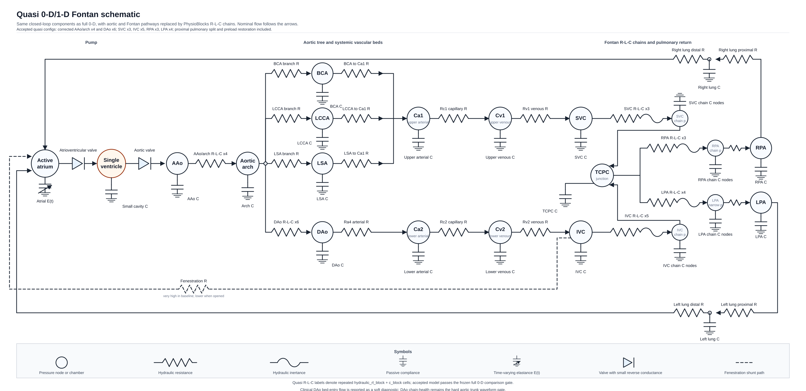

# Quasi 0-D/1-D Fontan Model Technical Reference

This document is generated from repository sources by `scripts/docs/build_model_reference_pdfs.py`. Edit the model config, implementation notes, schematic, or this generator, then regenerate the markdown and PDF together.

## Model Construction

### Scope and Status

Accepted PhysioBlocks-only quasi 0-D/1-D model.

This model keeps the accepted full 0-D heart, atrium, valves, systemic beds, pulmonary RCR beds, and fenestration, while replacing selected aortic and Fontan conduit shortcuts with distributed R-L-C chains.

It does not contain a nonlinear 1-D PDE solver. Its quasi-1-D behavior comes from repeated hydraulic R-L links and compliance states embedded in the closed loop.

The accepted baseline is selected by the frozen quasi-vs-full0D superiority gate.

### Schematic

{ width=100% }

### Accepted Components

- active atrium and active spherical ventricle retained from full 0-D
- atrioventricular and aortic valve R-L blocks retained from full 0-D
- AAo/arch, DAo, SVC, IVC, RPA, and LPA quasi R-L-C chains
- upper and lower systemic vascular beds
- right and left pulmonary RCR Windkessel beds
- scenario-specific pulmonary vasodilation, fenestration, and LPA obstruction variants without scenario-specific retuning

### Authoritative Baseline Config

The executable topology and free-parameter values are taken from `models/quasi_0d_1d/configs/fontan_quasi_baseline.jsonc`.

- pressure nodes: 36
- blocks/segments: 84
- free parameter entries: 146
- boundary conditions: 0

### Scenario Configs

- `models/quasi_0d_1d/configs/fontan_quasi_baseline.jsonc`
- `models/quasi_0d_1d/configs/fontan_quasi_fenestration.jsonc`
- `models/quasi_0d_1d/configs/fontan_quasi_lpa_obstruction.jsonc`
- `models/quasi_0d_1d/configs/fontan_quasi_smoke.jsonc`
- `models/quasi_0d_1d/configs/fontan_quasi_vasodilation.jsonc`

### Pressure Nodes

- `atrial`
- `cavity`
- `aao`
- `aortic_arch`
- `bca`
- `lcca`
- `lsa`
- `upper_art`
- `upper_ven`
- `dao`
- `lower_art`
- `lower_ven`
- `svc`
- `ivc`
- `tcpc`
- `rpa`
- `lpa`
- `quasi_aao_arch_p_01`
- `quasi_aao_arch_p_02`
- `quasi_aao_arch_p_03`
- `quasi_dao_p_01`
- `quasi_dao_p_02`
- `quasi_dao_p_03`
- `quasi_dao_p_04`
- `quasi_dao_p_05`
- `quasi_svc_p_01`
- `quasi_svc_p_02`
- `quasi_ivc_p_01`
- `quasi_ivc_p_02`
- `quasi_ivc_p_03`
- `quasi_ivc_p_04`
- `quasi_rpa_p_01`
- `quasi_rpa_p_02`
- `quasi_lpa_p_01`
- `quasi_lpa_p_02`
- `quasi_lpa_p_03`

### Block Type Counts

| Block type | Count |
|---|---:|
| `c_block` | 41 |
| `hydraulic_rl_block` | 25 |
| `rc_block` | 12 |
| `rcr_block` | 2 |
| `spherical_cavity_block` | 1 |
| `time_varying_elastance_atrium_block` | 1 |
| `valve_rl_block` | 2 |

## Governing Equations

The sign convention follows PhysioBlocks local block fluxes. For a two-node flow element, local node 1 is the first node listed in the config and local node 2 is the second node listed in the config.

### Nodal Conservation

At every pressure node, the algebraic/differential network residual is the sum of all block flux contributions attached to that node:

$$\sum_{b \in \mathcal{B}(i)} Q_{b,i} = 0.$$

Storage blocks contribute pressure derivatives to this same residual, so closed-loop volume conservation is enforced through the connected block equations rather than through prescribed boundary flow.

### Passive Compliance Block

For a `c_block` at pressure node `P` with capacitance `C`:

$$Q = -C \frac{dP}{dt}.$$

The saved stored volume is proportional to pressure in the local linear compliance approximation:

$$V = C P.$$

### Pure RC Resistor Convention

This repository uses `rc_block` with zero capacitance as a pure resistive link. PhysioBlocks defines the local fluxes as:

$$Q_1 = \frac{P_2 - P_1}{R},$$

$$Q_2 = \frac{P_1 - P_2}{R} - C \frac{dP_2}{dt}.$$

When `C = 0`, the block is used as a pure resistor. To represent an upstream-to-downstream path with positive physical flow from upstream to downstream, the configs assign local node 2 to the upstream pressure and local node 1 to the downstream pressure.

### Hydraulic R-L Link

The local quasi-vessel R-L element uses positive internal flow from local node 1 to local node 2:

$$L \frac{dQ}{dt} + RQ = P_1 - P_2,$$

$$Q_1 = -Q,\qquad Q_2 = Q.$$

This is the repeated segment equation used by the quasi 0-D/1-D chains.

### Valve R-L Block

The R-L valve block has local positive flow from node 1 to node 2 and switches conductance according to flow direction:

$$L \frac{dQ}{dt} + P_2 - P_1 + R(Q)Q = 0,$$

$$R(Q) = \begin{cases}1/G_f,& Q>0,\\ 1/G_b,& Q<0,\end{cases}$$

$$Q_1=-Q,\qquad Q_2=Q.$$

`G_f` is the forward conductance and `G_b` is the backward conductance.

### Pulmonary RCR Windkessel

For an `rcr_block` with inlet pressure `P_1`, outlet pressure `P_2`, middle pressure `P_m`, proximal resistance `R_1`, distal resistance `R_2`, and compliance `C`:

$$Q_1 = \frac{P_m - P_1}{R_1},$$

$$Q_2 = \frac{P_m - P_2}{R_2},$$

$$\frac{P_1 - P_m}{R_1} + \frac{P_2 - P_m}{R_2} - C\frac{dP_m}{dt}=0.$$

### Active Atrium

The active atrium is a one-node time-varying elastance chamber:

$$E(t) = E_{min} + (E_{max}-E_{min})a(t),$$

$$V_a(t) = V_{0,a} + \frac{P_a(t)-P_{ext}}{E(t)},$$

$$Q_a = -\frac{dV_a}{dt}.$$

The activation `a(t)` is a raised-cosine pulse over the configured start, peak, and end phase of the cardiac cycle.

### Spherical Ventricular Cavity

The active ventricular cavity stores volume through the spherical cavity displacement `y`, reference radius `R_0`, and wall thickness `d_0`:

$$V(y)=\frac{4\pi}{3}\left[R_0\left(1+\frac{y}{R_0}\right)-\frac{d_0}{2\left(1+\frac{y}{R_0}\right)^2}\right]^3,$$

$$Q_v = -\frac{dV(y)}{dt}.$$

The pressure-displacement relation comes from the configured PhysioBlocks spherical dynamics, velocity law, passive rheology, and active macro-Huxley submodels. The corresponding free parameters are listed in the parameter inventory below with the `cavity.*` prefix.

## Quasi Chain Summary

The accepted quasi chains are assembled from repeated hydraulic R-L links and downstream compliance states. Total values in this table are computed from the baseline config.

| Chain | Path | Segments | Total R ($\mathrm{Pa\,s\,m^{-3}}$) | Total L ($\mathrm{Pa\,s^{2}\,m^{-3}}$) | Total C ($\mathrm{m^{3}\,Pa^{-1}}$) |
|---|---|---:|---:|---:|---:|
| `aao_arch` | `aao` -> `aortic_arch` | 4 | 207755 | 100223 | 3.14191e-10 |
| `dao` | `aortic_arch` -> `dao` | 6 | 3.56544e+06 | 744674 | 3.9886e-10 |
| `svc` | `svc` -> `tcpc` | 3 | 5.86617e+06 | 62815.8 | 4.76865e-10 |
| `ivc` | `ivc` -> `tcpc` | 5 | 4.39963e+06 | 108574 | 3.66194e-09 |
| `rpa` | `tcpc` -> `rpa` | 3 | 2.3998e+06 | 95832 | 1.903e-10 |
| `lpa` | `tcpc` -> `lpa` | 4 | 3.46637e+06 | 841348 | 2.10762e-10 |

## Segment Inventory

Each row is a block or segment in the accepted baseline config. The parameter column lists explicit block fields and all config parameters sharing the block-name prefix.

| Segment/block | Type | Local nodes | Free-parameter fields |
|---|---|---|---|
| `cavity` | `spherical_cavity_block` | 1: cavity | disp = cavity.dynamics.disp; radius -> heart_radius; thickness -> heart_thickness; cavity.dynamics.damping_coef; cavity.dynamics.hyperelastic_cst; cavity.dynamics.vol_mass; cavity.rheology.active_law.activation; cavity.rheology.active_law.crossbridge_stiffness; cavity.rheology.active_law.destruction_rate; cavity.rheology.active_law.starling_abscissas; cavity.rheology.active_law.starling_ordinates; cavity.rheology.damping_parallel; cavity.rheology.series_stiffness; cavity.velocity_law.scheme_ts_hht |
| `valve_atrium` | `valve_rl_block` | 1: atrial; 2: cavity | backward_conductance -> valves.backward_conductance; valve_atrium.conductance; valve_atrium.inductance; valve_atrium.scheme_ts_flux |
| `valve_arterial` | `valve_rl_block` | 1: cavity; 2: aao | backward_conductance -> valves.backward_conductance; valve_arterial.conductance; valve_arterial.inductance; valve_arterial.scheme_ts_flux |
| `capacitance_valve` | `c_block` | 1: cavity | capacitance_valve.capacitance |
| `active_atrium` | `time_varying_elastance_atrium_block` | 1: atrial | pressure_external -> pleural.pressure; elastance_min -> active_atrium.elastance_min; elastance_max -> active_atrium.elastance_max; unstressed_volume -> active_atrium.unstressed_volume; activation_start -> active_atrium.activation_start; activation_peak -> active_atrium.activation_peak; activation_end -> active_atrium.activation_end; heartbeat_duration -> heartbeat_duration |
| `aao_compliance` | `c_block` | 1: aao | aao_compliance.capacitance |
| `aortic_arch_compliance` | `c_block` | 1: aortic_arch | aortic_arch_compliance.capacitance |
| `bca_compliance` | `c_block` | 1: bca | bca_compliance.capacitance |
| `lcca_compliance` | `c_block` | 1: lcca | lcca_compliance.capacitance |
| `lsa_compliance` | `c_block` | 1: lsa | lsa_compliance.capacitance |
| `upper_ca1` | `c_block` | 1: upper_art | upper_ca1.capacitance |
| `upper_cv1` | `c_block` | 1: upper_ven | upper_cv1.capacitance |
| `dao_compliance` | `c_block` | 1: dao | dao_compliance.capacitance |
| `lower_ca2` | `c_block` | 1: lower_art | lower_ca2.capacitance |
| `lower_cv2` | `c_block` | 1: lower_ven | lower_cv2.capacitance |
| `svc_compliance` | `c_block` | 1: svc | svc_compliance.capacitance |
| `ivc_compliance` | `c_block` | 1: ivc | ivc_compliance.capacitance |
| `tcpc_compliance` | `c_block` | 1: tcpc | tcpc_compliance.capacitance |
| `rpa_compliance` | `c_block` | 1: rpa | rpa_compliance.capacitance |
| `lpa_compliance` | `c_block` | 1: lpa | lpa_compliance.capacitance |
| `arch_bca` | `rc_block` | 1: bca; 2: aortic_arch | capacitance -> zero_capacitance; arch_bca.resistance |
| `upper_bca_to_ca1` | `rc_block` | 1: upper_art; 2: bca | capacitance -> zero_capacitance; upper_bca_to_ca1.resistance |
| `arch_lcca` | `rc_block` | 1: lcca; 2: aortic_arch | capacitance -> zero_capacitance; arch_lcca.resistance |
| `upper_lcca_to_ca1` | `rc_block` | 1: upper_art; 2: lcca | capacitance -> zero_capacitance; upper_lcca_to_ca1.resistance |
| `arch_lsa` | `rc_block` | 1: lsa; 2: aortic_arch | capacitance -> zero_capacitance; arch_lsa.resistance |
| `upper_lsa_to_ca1` | `rc_block` | 1: upper_art; 2: lsa | capacitance -> zero_capacitance; upper_lsa_to_ca1.resistance |
| `upper_rc1` | `rc_block` | 1: upper_ven; 2: upper_art | capacitance -> zero_capacitance; upper_rc1.resistance |
| `upper_rv1` | `rc_block` | 1: svc; 2: upper_ven | capacitance -> zero_capacitance; upper_rv1.resistance |
| `lower_ra4` | `rc_block` | 1: lower_art; 2: dao | capacitance -> zero_capacitance; lower_ra4.resistance |
| `lower_rc2` | `rc_block` | 1: lower_ven; 2: lower_art | capacitance -> zero_capacitance; lower_rc2.resistance |
| `lower_rv2` | `rc_block` | 1: ivc; 2: lower_ven | capacitance -> zero_capacitance; lower_rv2.resistance |
| `right_lung` | `rcr_block` | 1: rpa; 2: atrial | pressure_mid = right_lung.pressure_mid; resistance_1 -> right_lung.resistance_1; resistance_2 -> right_lung.resistance_2; capacitance -> right_lung.capacitance |
| `left_lung` | `rcr_block` | 1: lpa; 2: atrial | pressure_mid = left_lung.pressure_mid; resistance_1 -> left_lung.resistance_1; resistance_2 -> left_lung.resistance_2; capacitance -> left_lung.capacitance |
| `fenestration` | `rc_block` | 1: atrial; 2: ivc | capacitance -> zero_capacitance; fenestration.resistance |
| `quasi_aao_arch_rl_01` | `hydraulic_rl_block` | 1: aao; 2: quasi_aao_arch_p_01 | resistance -> quasi_aao_arch_rl_01.resistance; inductance -> quasi_aao_arch_rl_01.inductance |
| `quasi_aao_arch_c_01` | `c_block` | 1: quasi_aao_arch_p_01 | quasi_aao_arch_c_01.capacitance |
| `quasi_aao_arch_rl_02` | `hydraulic_rl_block` | 1: quasi_aao_arch_p_01; 2: quasi_aao_arch_p_02 | resistance -> quasi_aao_arch_rl_02.resistance; inductance -> quasi_aao_arch_rl_02.inductance |
| `quasi_aao_arch_c_02` | `c_block` | 1: quasi_aao_arch_p_02 | quasi_aao_arch_c_02.capacitance |
| `quasi_aao_arch_rl_03` | `hydraulic_rl_block` | 1: quasi_aao_arch_p_02; 2: quasi_aao_arch_p_03 | resistance -> quasi_aao_arch_rl_03.resistance; inductance -> quasi_aao_arch_rl_03.inductance |
| `quasi_aao_arch_c_03` | `c_block` | 1: quasi_aao_arch_p_03 | quasi_aao_arch_c_03.capacitance |
| `quasi_aao_arch_rl_04` | `hydraulic_rl_block` | 1: quasi_aao_arch_p_03; 2: aortic_arch | resistance -> quasi_aao_arch_rl_04.resistance; inductance -> quasi_aao_arch_rl_04.inductance |
| `quasi_aao_arch_c_04` | `c_block` | 1: aortic_arch | quasi_aao_arch_c_04.capacitance |
| `quasi_dao_rl_01` | `hydraulic_rl_block` | 1: aortic_arch; 2: quasi_dao_p_01 | resistance -> quasi_dao_rl_01.resistance; inductance -> quasi_dao_rl_01.inductance |
| `quasi_dao_c_01` | `c_block` | 1: quasi_dao_p_01 | quasi_dao_c_01.capacitance |
| `quasi_dao_rl_02` | `hydraulic_rl_block` | 1: quasi_dao_p_01; 2: quasi_dao_p_02 | resistance -> quasi_dao_rl_02.resistance; inductance -> quasi_dao_rl_02.inductance |
| `quasi_dao_c_02` | `c_block` | 1: quasi_dao_p_02 | quasi_dao_c_02.capacitance |
| `quasi_dao_rl_03` | `hydraulic_rl_block` | 1: quasi_dao_p_02; 2: quasi_dao_p_03 | resistance -> quasi_dao_rl_03.resistance; inductance -> quasi_dao_rl_03.inductance |
| `quasi_dao_c_03` | `c_block` | 1: quasi_dao_p_03 | quasi_dao_c_03.capacitance |
| `quasi_dao_rl_04` | `hydraulic_rl_block` | 1: quasi_dao_p_03; 2: quasi_dao_p_04 | resistance -> quasi_dao_rl_04.resistance; inductance -> quasi_dao_rl_04.inductance |
| `quasi_dao_c_04` | `c_block` | 1: quasi_dao_p_04 | quasi_dao_c_04.capacitance |
| `quasi_dao_rl_05` | `hydraulic_rl_block` | 1: quasi_dao_p_04; 2: quasi_dao_p_05 | resistance -> quasi_dao_rl_05.resistance; inductance -> quasi_dao_rl_05.inductance |
| `quasi_dao_c_05` | `c_block` | 1: quasi_dao_p_05 | quasi_dao_c_05.capacitance |
| `quasi_dao_rl_06` | `hydraulic_rl_block` | 1: quasi_dao_p_05; 2: dao | resistance -> quasi_dao_rl_06.resistance; inductance -> quasi_dao_rl_06.inductance |
| `quasi_dao_c_06` | `c_block` | 1: dao | quasi_dao_c_06.capacitance |
| `quasi_svc_rl_01` | `hydraulic_rl_block` | 1: svc; 2: quasi_svc_p_01 | resistance -> quasi_svc_rl_01.resistance; inductance -> quasi_svc_rl_01.inductance |
| `quasi_svc_c_01` | `c_block` | 1: quasi_svc_p_01 | quasi_svc_c_01.capacitance |
| `quasi_svc_rl_02` | `hydraulic_rl_block` | 1: quasi_svc_p_01; 2: quasi_svc_p_02 | resistance -> quasi_svc_rl_02.resistance; inductance -> quasi_svc_rl_02.inductance |
| `quasi_svc_c_02` | `c_block` | 1: quasi_svc_p_02 | quasi_svc_c_02.capacitance |
| `quasi_svc_rl_03` | `hydraulic_rl_block` | 1: quasi_svc_p_02; 2: tcpc | resistance -> quasi_svc_rl_03.resistance; inductance -> quasi_svc_rl_03.inductance |
| `quasi_svc_c_03` | `c_block` | 1: tcpc | quasi_svc_c_03.capacitance |
| `quasi_ivc_rl_01` | `hydraulic_rl_block` | 1: ivc; 2: quasi_ivc_p_01 | resistance -> quasi_ivc_rl_01.resistance; inductance -> quasi_ivc_rl_01.inductance |
| `quasi_ivc_c_01` | `c_block` | 1: quasi_ivc_p_01 | quasi_ivc_c_01.capacitance |
| `quasi_ivc_rl_02` | `hydraulic_rl_block` | 1: quasi_ivc_p_01; 2: quasi_ivc_p_02 | resistance -> quasi_ivc_rl_02.resistance; inductance -> quasi_ivc_rl_02.inductance |
| `quasi_ivc_c_02` | `c_block` | 1: quasi_ivc_p_02 | quasi_ivc_c_02.capacitance |
| `quasi_ivc_rl_03` | `hydraulic_rl_block` | 1: quasi_ivc_p_02; 2: quasi_ivc_p_03 | resistance -> quasi_ivc_rl_03.resistance; inductance -> quasi_ivc_rl_03.inductance |
| `quasi_ivc_c_03` | `c_block` | 1: quasi_ivc_p_03 | quasi_ivc_c_03.capacitance |
| `quasi_ivc_rl_04` | `hydraulic_rl_block` | 1: quasi_ivc_p_03; 2: quasi_ivc_p_04 | resistance -> quasi_ivc_rl_04.resistance; inductance -> quasi_ivc_rl_04.inductance |
| `quasi_ivc_c_04` | `c_block` | 1: quasi_ivc_p_04 | quasi_ivc_c_04.capacitance |
| `quasi_ivc_rl_05` | `hydraulic_rl_block` | 1: quasi_ivc_p_04; 2: tcpc | resistance -> quasi_ivc_rl_05.resistance; inductance -> quasi_ivc_rl_05.inductance |
| `quasi_ivc_c_05` | `c_block` | 1: tcpc | quasi_ivc_c_05.capacitance |
| `quasi_rpa_rl_01` | `hydraulic_rl_block` | 1: tcpc; 2: quasi_rpa_p_01 | resistance -> quasi_rpa_rl_01.resistance; inductance -> quasi_rpa_rl_01.inductance |
| `quasi_rpa_c_01` | `c_block` | 1: quasi_rpa_p_01 | quasi_rpa_c_01.capacitance |
| `quasi_rpa_rl_02` | `hydraulic_rl_block` | 1: quasi_rpa_p_01; 2: quasi_rpa_p_02 | resistance -> quasi_rpa_rl_02.resistance; inductance -> quasi_rpa_rl_02.inductance |
| `quasi_rpa_c_02` | `c_block` | 1: quasi_rpa_p_02 | quasi_rpa_c_02.capacitance |
| `quasi_rpa_rl_03` | `hydraulic_rl_block` | 1: quasi_rpa_p_02; 2: rpa | resistance -> quasi_rpa_rl_03.resistance; inductance -> quasi_rpa_rl_03.inductance |
| `quasi_rpa_c_03` | `c_block` | 1: rpa | quasi_rpa_c_03.capacitance |
| `quasi_lpa_rl_01` | `hydraulic_rl_block` | 1: tcpc; 2: quasi_lpa_p_01 | resistance -> quasi_lpa_rl_01.resistance; inductance -> quasi_lpa_rl_01.inductance |
| `quasi_lpa_c_01` | `c_block` | 1: quasi_lpa_p_01 | quasi_lpa_c_01.capacitance |
| `quasi_lpa_rl_02` | `hydraulic_rl_block` | 1: quasi_lpa_p_01; 2: quasi_lpa_p_02 | resistance -> quasi_lpa_rl_02.resistance; inductance -> quasi_lpa_rl_02.inductance |
| `quasi_lpa_c_02` | `c_block` | 1: quasi_lpa_p_02 | quasi_lpa_c_02.capacitance |
| `quasi_lpa_rl_03` | `hydraulic_rl_block` | 1: quasi_lpa_p_02; 2: quasi_lpa_p_03 | resistance -> quasi_lpa_rl_03.resistance; inductance -> quasi_lpa_rl_03.inductance |
| `quasi_lpa_c_03` | `c_block` | 1: quasi_lpa_p_03 | quasi_lpa_c_03.capacitance |
| `quasi_lpa_rl_04` | `hydraulic_rl_block` | 1: quasi_lpa_p_03; 2: lpa | resistance -> quasi_lpa_rl_04.resistance; inductance -> quasi_lpa_rl_04.inductance |
| `quasi_lpa_c_04` | `c_block` | 1: lpa | quasi_lpa_c_04.capacitance |

## Free Parameters

Unless a parameter states otherwise in the config, units follow the repository SI convention: pressure in $\mathrm{Pa}$, flow in $\mathrm{m^{3}\,s^{-1}}$, resistance in $\mathrm{Pa\,s\,m^{-3}}$, capacitance in $\mathrm{m^{3}\,Pa^{-1}}$, inertance in $\mathrm{Pa\,s^{2}\,m^{-3}}$, volume in $\mathrm{m^{3}}$, length in $\mathrm{m}$, and time in $\mathrm{s}$.

The entries below are the complete `parameters` dictionary from the authoritative baseline config. Derived-expression entries are shown as compact JSON.

- `aao_compliance.capacitance` = `8.0006800578e-11`
- `active_atrium.activation_end` = `0.98`
- `active_atrium.activation_peak` = `0.9`
- `active_atrium.activation_start` = `0.78`
- `active_atrium.elastance_max` = `66661000`
- `active_atrium.elastance_min` = `16665250`
- `active_atrium.unstressed_volume` = `4.2e-05`
- `active_law.activation.max` = `35`
- `active_law.activation.min` = `-20`
- `aortic_arch_compliance.capacitance` = `1.00008500723e-10`
- `arch_bca.resistance` = `5332880`
- `arch_lcca.resistance` = `7999320`
- `arch_lsa.resistance` = `7999320`
- `bca_compliance.capacitance` = `3.00025502168e-09`
- `capacitance_valve.capacitance` = `5e-12`
- `cavity.dynamics.damping_coef` = `70`
- `cavity.dynamics.hyperelastic_cst` = `[444.0,2.9,69.0,6.5]`
- `cavity.dynamics.vol_mass` = `1000`
- `cavity.rheology.active_law.activation` = `{"alpha":"diastole_scaling_factor","phases":[0,0,1,1,1,0,0],"reference_function":[[0.0,"active_law.activation.min"],[0.027,"active_law.activation.min"],[0.037,0.0],[0.145,"active_law.activation.max"],[0.309,"active_law.activation.max"],[0.417,0.0],[0.427,"active_law.activation.min"],[0.9,"active_law.activation.min"]],"rescaled_period":"heartbeat_duration","type":"rescale_two_phases_function"}`
- `cavity.rheology.active_law.crossbridge_stiffness` = `273000`
- `cavity.rheology.active_law.destruction_rate` = `12`
- `cavity.rheology.active_law.starling_abscissas` = `[-0.1668,-0.0073,0.0534,0.0969,0.1326,0.2016,0.4663,0.9187,1.1762]`
- `cavity.rheology.active_law.starling_ordinates` = `[0.0,0.5614,0.7748,0.8933,0.9618,1.0,1.0,0.1075,0.0]`
- `cavity.rheology.damping_parallel` = `70`
- `cavity.rheology.series_stiffness` = `100000000`
- `cavity.velocity_law.scheme_ts_hht` = `0.4`
- `conduit.scheme_ts_flux` = `0.25`
- `dao_compliance.capacitance` = `1.80015301301e-10`
- `diastole_scaling_factor` = `0.8`
- `fenestration.resistance` = `1.33322e+14`
- `heart_contractility` = `39690`
- `heart_radius` = `0.0245531`
- `heart_rate` = `69.9300699301`
- `heart_thickness` = `0.008160295`
- `heartbeat_duration` = `{"factors":[60.0],"inverses":["heart_rate"],"type":"product"}`
- `ivc_compliance.capacitance` = `2.13768170294e-07`
- `lcca_compliance.capacitance` = `1.50012751084e-09`
- `left_lung.capacitance` = `3.00025502168e-08`
- `left_lung.resistance_1` = `15546678.42`
- `left_lung.resistance_2` = `8371288.38`
- `lower_ca2.capacitance` = `1.25010625903e-08`
- `lower_cv2.capacitance` = `8.55072681178e-08`
- `lower_ra4.resistance` = `229804464.96`
- `lower_rc2.resistance` = `9827164.62`
- `lower_rv2.resistance` = `2267807.22`
- `lpa_compliance.capacitance` = `1.12509563313e-08`
- `lsa_compliance.capacitance` = `1.50012751084e-09`
- `pleural.pressure` = `0`
- `quasi_aao_arch_c_01.capacitance` = `1.06684947589e-10`
- `quasi_aao_arch_c_02.capacitance` = `8.65153768159e-11`
- `quasi_aao_arch_c_03.capacitance` = `6.84630538033e-11`
- `quasi_aao_arch_c_04.capacitance` = `5.25279785514e-11`
- `quasi_aao_arch_rl_01.inductance` = `17213.346097`
- `quasi_aao_arch_rl_01.resistance` = `22695.9439317`
- `quasi_aao_arch_rl_02.inductance` = `21226.3414179`
- `quasi_aao_arch_rl_02.resistance` = `34619.085625`
- `quasi_aao_arch_rl_03.inductance` = `26823.298468`
- `quasi_aao_arch_rl_03.resistance` = `55522.8933759`
- `quasi_aao_arch_rl_04.inductance` = `34960.5101288`
- `quasi_aao_arch_rl_04.resistance` = `94917.4266251`
- `quasi_dao_c_01.capacitance` = `8.84084249797e-11`
- `quasi_dao_c_02.capacitance` = `7.89166401957e-11`
- `quasi_dao_c_03.capacitance` = `6.99641613653e-11`
- `quasi_dao_c_04.capacitance` = `6.15509884886e-11`
- `quasi_dao_c_05.capacitance` = `5.36771215655e-11`
- `quasi_dao_c_06.capacitance` = `4.6342560596e-11`
- `quasi_dao_rl_01.inductance` = `88916.2832192`
- `quasi_dao_rl_01.resistance` = `290023.503509`
- `quasi_dao_rl_02.inductance` = `99610.7859504`
- `quasi_dao_rl_02.resistance` = `364163.26054`
- `quasi_dao_rl_03.inductance` = `112356.789549`
- `quasi_dao_rl_03.resistance` = `463591.768637`
- `quasi_dao_rl_04.inductance` = `127714.416088`
- `quasi_dao_rl_04.resistance` = `599408.164486`
- `quasi_dao_rl_05.inductance` = `146448.772311`
- `quasi_dao_rl_05.resistance` = `788837.155596`
- `quasi_dao_rl_06.inductance` = `169626.979031`
- `quasi_dao_rl_06.resistance` = `1059418.36317`
- `quasi_ivc_c_01.capacitance` = `9.36020049527e-10`
- `quasi_ivc_c_02.capacitance` = `8.27515133881e-10`
- `quasi_ivc_c_03.capacitance` = `7.25698877418e-10`
- `quasi_ivc_c_04.capacitance` = `6.30571280139e-10`
- `quasi_ivc_c_05.capacitance` = `5.42132342044e-10`
- `quasi_ivc_rl_01.inductance` = `16371.4663236`
- `quasi_ivc_rl_01.resistance` = `481040.236632`
- `quasi_ivc_rl_02.inductance` = `18518.1153694`
- `quasi_ivc_rl_02.resistance` = `615845.339818`
- `quasi_ivc_rl_03.inductance` = `21116.2249191`
- `quasi_ivc_rl_03.resistance` = `801382.312152`
- `quasi_ivc_rl_04.inductance` = `24301.8056828`
- `quasi_ivc_rl_04.resistance` = `1062399.70537`
- `quasi_ivc_rl_05.inductance` = `28266.1991006`
- `quasi_ivc_rl_05.resistance` = `1438958.40603`
- `quasi_lpa.narrowing_radius_m` = `0.003`
- `quasi_lpa.narrowing_resistance_scale` = `1`
- `quasi_lpa_c_01.capacitance` = `9.20271250531e-11`
- `quasi_lpa_c_02.capacitance` = `5.37066818133e-11`
- `quasi_lpa_c_03.capacitance` = `2.79163314694e-11`
- `quasi_lpa_c_04.capacitance` = `3.71122994829e-11`
- `quasi_lpa_rl_01.inductance` = `166516.34733`
- `quasi_lpa_rl_01.resistance` = `418377.82423`
- `quasi_lpa_rl_02.inductance` = `285328.01137`
- `quasi_lpa_rl_02.resistance` = `1299644.4096`
- `quasi_lpa_rl_03.inductance` = `222292.645222`
- `quasi_lpa_rl_03.resistance` = `1119737.36501`
- `quasi_lpa_rl_04.inductance` = `167211.281804`
- `quasi_lpa_rl_04.resistance` = `628612.401151`
- `quasi_rpa_c_01.capacitance` = `6.34334120112e-11`
- `quasi_rpa_c_02.capacitance` = `6.34334120112e-11`
- `quasi_rpa_c_03.capacitance` = `6.34334120112e-11`
- `quasi_rpa_rl_01.inductance` = `31943.9980454`
- `quasi_rpa_rl_01.resistance` = `799932`
- `quasi_rpa_rl_02.inductance` = `31943.9980454`
- `quasi_rpa_rl_02.resistance` = `799932`
- `quasi_rpa_rl_03.inductance` = `31943.9980454`
- `quasi_rpa_rl_03.resistance` = `799932`
- `quasi_svc_c_01.capacitance` = `2.02745289685e-10`
- `quasi_svc_c_02.capacitance` = `1.57000040638e-10`
- `quasi_svc_c_03.capacitance` = `1.1711956711e-10`
- `quasi_svc_rl_01.inductance` = `15616.2443439`
- `quasi_svc_rl_01.resistance` = `1026122.68543`
- `quasi_svc_rl_02.inductance` = `20166.3641004`
- `quasi_svc_rl_02.resistance` = `1720931.87678`
- `quasi_svc_rl_03.inductance` = `27033.2281907`
- `quasi_svc_rl_03.resistance` = `3119113.43779`
- `right_lung.capacitance` = `3.00025502168e-08`
- `right_lung.resistance_1` = `10763085.06`
- `right_lung.resistance_2` = `5795507.34`
- `rpa_compliance.capacitance` = `1.12509563313e-08`
- `svc_compliance.capacitance` = `1.4251211353e-07`
- `tcpc_compliance.capacitance` = `1.20010200867e-09`
- `upper_bca_to_ca1.resistance` = `49595784`
- `upper_ca1.capacitance` = `1.50012751084e-08`
- `upper_cv1.capacitance` = `5.70048454119e-08`
- `upper_lcca_to_ca1.resistance` = `99458212`
- `upper_lsa_to_ca1.resistance` = `99458212`
- `upper_rc1.resistance` = `156439020.571`
- `upper_rv1.resistance` = `67045294.5306`
- `valve_arterial.conductance` = `1.3e-05`
- `valve_arterial.inductance` = `30000`
- `valve_arterial.scheme_ts_flux` = `0.25`
- `valve_atrium.conductance` = `9e-06`
- `valve_atrium.inductance` = `1000`
- `valve_atrium.scheme_ts_flux` = `0.25`
- `valves.backward_conductance` = `5e-12`
- `zero_capacitance` = `0`

## Documentation and Regeneration

Model-local documentation artifacts:

- `models/quasi_0d_1d/README.md`
- `models/quasi_0d_1d/docs/quasi_0d_1d_schematic.svg`
- `models/quasi_0d_1d/docs/quasi_0d_1d_schematic.png`
- `models/quasi_0d_1d/docs/implementation_notes.md`
- `models/quasi_0d_1d/docs/quasi_0d_1d_technical_reference.md`
- `models/quasi_0d_1d/docs/quasi_0d_1d_technical_reference.pdf`

Regenerate the technical reference source and PDF with:

```bash
python3 scripts/docs/build_model_reference_pdfs.py --model quasi_0d_1d
```

## Current Limitations

- The model is quasi 0-D/1-D only; wave propagation is approximated by finite R-L-C chains rather than by a true coupled 1-D solver.
- Clinical DAo bed-entry flow remains a soft diagnostic because it mixes aortic trunk behavior with downstream terminal-load dynamics.
- The model is not clinically validated.

The model parameters and standardized data are for computational development and calibration workflows. Simulation outputs must not be presented as clinically validated without separate validation and documentation.
